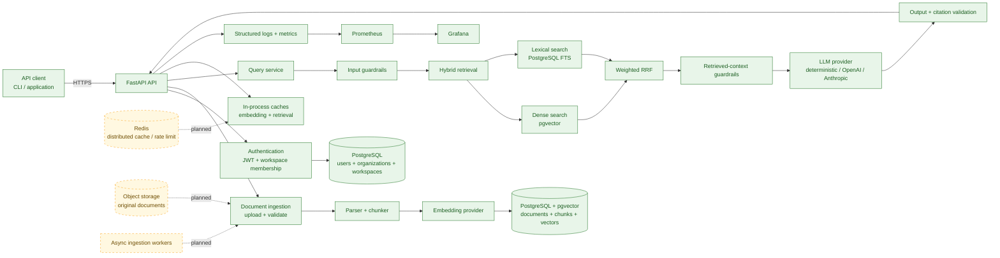

# RAG Agent

[](https://github.com/FarnazNK/rag-agent/actions/workflows/ci.yml)


**Live:** [API Docs](https://rag-agent-api-2uau.onrender.com/docs) · [Liveness](https://rag-agent-api-2uau.onrender.com/health/live) · [Readiness](https://rag-agent-api-2uau.onrender.com/health/ready)

RAG Agent is a multi-tenant retrieval-augmented generation API for document ingestion, hybrid retrieval, grounded answers, evaluation, and operational reliability. It combines FastAPI with PostgreSQL/pgvector, lexical search, weighted reciprocal-rank fusion, authentication, guardrails, observability, and reproducible quality gates.

> **Status:** A public portfolio API is live on Render with managed Neon PostgreSQL/pgvector and deterministic providers. The repository also includes a complete local Docker Compose stack, JWT authentication, workspace-scoped retrieval, Prometheus/Grafana monitoring, Terraform infrastructure, evaluation datasets, and GitHub Actions CI. The hosted instance is a demo deployment rather than a production SLA.

## Highlights

- Authenticated document upload, re-index, deletion, and query APIs
- Multi-tenant organizations and workspaces with membership-based authorization
- PostgreSQL persistence with pgvector dense retrieval
- PostgreSQL lexical/full-text retrieval for exact terms, acronyms, and policy names
- Weighted reciprocal-rank fusion for hybrid search
- Document parsing and bounded overlapping chunking
- Deterministic local embedding and LLM providers for reproducible development and CI
- Optional OpenAI and Anthropic provider adapters
- Prompt-injection checks on user input and retrieved context
- PII/output guardrails and citation validation
- Persistent ingestion-job state and explicit failure codes
- Retrieval and embedding caches with invalidation through workspace index versions
- Structured JSON logging and request correlation IDs
- Prometheus metrics and Grafana dashboard
- Evaluation datasets for quality and adversarial behavior
- Benchmark regression gates for latency
- GitHub Actions CI for linting, formatting, mypy, migrations, tests, evaluations, security scanning, and Docker builds
- Docker Compose stack for API, PostgreSQL/pgvector, Prometheus, and Grafana
- Terraform configuration for environment-specific infrastructure
- Alembic database migrations

## Architecture



The diagram uses green for components implemented in this repository and dashed yellow for planned scale-out components. The current implementation keeps rate limiting and caches process-local; Redis and asynchronous ingestion workers are intentionally shown as future production scaling work rather than claimed as operational.

See [`docs/architecture.md`](docs/architecture.md) for architecture details and [`docs/adr/`](docs/adr/) for design decisions.

### Retrieval pipeline

A query follows this path:

```text
JWT + workspace authorization
        ↓
input guardrails
        ↓
dense retrieval + lexical retrieval
        ↓
weighted reciprocal-rank fusion
        ↓
retrieved-context guardrails
        ↓
LLM generation
        ↓
citation + output validation
        ↓
grounded response
```

Dense retrieval provides semantic matching while lexical retrieval preserves exact terms, policy names, acronyms, and identifiers. Weighted reciprocal-rank fusion combines both result sets before generation.

### API surface

| Route | Purpose |
| --- | --- |
| `POST /v1/auth/bootstrap` | Bootstrap the initial local/admin workspace when enabled |
| `POST /v1/auth/login` | Authenticate and issue an access token |
| `GET /v1/workspaces` | List workspaces available to the current user |
| `POST /v1/documents/upload` | Validate, parse, chunk, embed, and persist a document |
| `POST /v1/documents/{id}/reindex` | Rebuild persisted chunks and embeddings |
| `DELETE /v1/documents/{id}` | Delete a document and invalidate retrieval state |
| `POST /v1/query` | Run workspace-scoped hybrid retrieval and generation |
| `GET /health/live` | Liveness check |
| `GET /health/ready` | Readiness check |
| `GET /metrics` | Prometheus metrics |

## Deployment status

A public portfolio/demo API is currently deployed on Render:

- **Liveness:** <https://rag-agent-api-2uau.onrender.com/health/live>
- **Readiness:** <https://rag-agent-api-2uau.onrender.com/health/ready>
- **OpenAPI docs:** <https://rag-agent-api-2uau.onrender.com/docs>

The hosted service uses managed Neon PostgreSQL with pgvector enabled and applies
Alembic migrations at startup. It runs the deterministic embedding and LLM
providers so the public demo does not require paid model API calls. Bootstrap-admin
mode is disabled in the hosted environment.

The repository still supports the full local stack:

- FastAPI API: `http://localhost:8000`
- OpenAPI docs: `http://localhost:8000/docs`
- Prometheus: `http://localhost:9090`
- Grafana: `http://localhost:3000`

A production deployment would still require production-grade secret management,
scaling, monitoring/alerting, backup policy, and provider credentials when external
models are enabled.

### CI/CD and Docker

Every push and pull request to `main` runs the GitHub Actions workflow in `.github/workflows/ci.yml`.

The workflow performs:

1. Python dependency installation
2. Ruff linting
3. Ruff formatting validation
4. mypy type checking
5. Alembic database migration
6. unit tests
7. PostgreSQL/pgvector integration tests
8. quality evaluation gates
9. adversarial evaluation gates
10. benchmark regression checks
11. evaluation/benchmark artifact upload
12. `pip-audit` dependency scanning
13. production Docker image build

The Docker Compose stack includes:

```text
api
postgres / pgvector
prometheus
grafana
```

Build the application image directly with:

```bash
docker build -t rag-agent:local .
```

Or start the local stack with:

```bash
docker compose up --build
```

Publishing a Docker image is not the same as deploying a production service. A production environment must still provide managed infrastructure, secrets, networking, migrations, and rollout/rollback controls.

### Infrastructure as Code

Terraform files live in:

```text
infra/terraform/
```

Environment-specific variable files are included for:

```text
dev
staging
production
```

See [`docs/deployment.md`](docs/deployment.md) for the intended release flow and rollback strategy.

## Technology stack

- **API:** Python 3.11+, FastAPI, Pydantic v2
- **Database:** PostgreSQL 16, SQLAlchemy, psycopg
- **Vector search:** pgvector