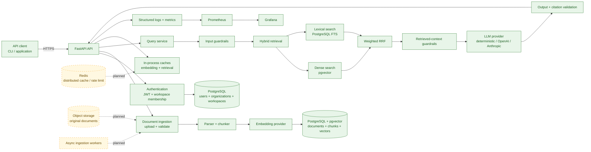

# RAG Agent

[](https://github.com/FarnazNK/rag-agent/actions/workflows/ci.yml)


RAG Agent is a multi-tenant retrieval-augmented generation API for document ingestion, hybrid retrieval, grounded answers, evaluation, and operational reliability. It combines FastAPI with PostgreSQL/pgvector, lexical search, weighted reciprocal-rank fusion, authentication, guardrails, observability, and reproducible quality gates.

> **Status:** A public portfolio API is live on Render with managed Neon PostgreSQL/pgvector and deterministic providers. The repository also includes a complete local Docker Compose stack, JWT authentication, workspace-scoped retrieval, Prometheus/Grafana monitoring, Terraform infrastructure, evaluation datasets, and GitHub Actions CI. The hosted instance is a demo deployment rather than a production SLA.

## Highlights

- Authenticated document upload, re-index, deletion, and query APIs
- Multi-tenant organizations and workspaces with membership-based authorization
- PostgreSQL persistence with pgvector dense retrieval
- PostgreSQL lexical/full-text retrieval for exact terms, acronyms, and policy names
- Weighted reciprocal-rank fusion for hybrid search
- Document parsing and bounded overlapping chunking
- Deterministic local embedding and LLM providers for reproducible development and CI
- Optional OpenAI and Anthropic provider adapters
- Prompt-injection checks on user input and retrieved context
- PII/output guardrails and citation validation
- Persistent ingestion-job state and explicit failure codes
- Retrieval and embedding caches with invalidation through workspace index versions
- Structured JSON logging and request correlation IDs
- Prometheus metrics and Grafana dashboard
- Evaluation datasets for quality and adversarial behavior
- Benchmark regression gates for latency
- GitHub Actions CI for linting, formatting, mypy, migrations, tests, evaluations, security scanning, and Docker builds
- Docker Compose stack for API, PostgreSQL/pgvector, Prometheus, and Grafana
- Terraform configuration for environment-specific infrastructure
- Alembic database migrations

## Architecture



The diagram uses green for components implemented in this repository and dashed yellow for planned scale-out components. The current implementation keeps rate limiting and caches process-local; Redis and asynchronous ingestion workers are intentionally shown as future production scaling work rather than claimed as operational.

See [`docs/architecture.md`](docs/architecture.md) for architecture details and [`docs/adr/`](docs/adr/) for design decisions.

### Retrieval pipeline

A query follows this path:

```text
JWT + workspace authorization
        ↓
input guardrails
        ↓
dense retrieval + lexical retrieval
        ↓
weighted reciprocal-rank fusion
        ↓
retrieved-context guardrails
        ↓
LLM generation
        ↓
citation + output validation
        ↓
grounded response
```

Dense retrieval provides semantic matching while lexical retrieval preserves exact terms, policy names, acronyms, and identifiers. Weighted reciprocal-rank fusion combines both result sets before generation.

### API surface

| Route | Purpose |
| --- | --- |
| `POST /v1/auth/bootstrap` | Bootstrap the initial local/admin workspace when enabled |
| `POST /v1/auth/login` | Authenticate and issue an access token |
| `GET /v1/workspaces` | List workspaces available to the current user |
| `POST /v1/documents/upload` | Validate, parse, chunk, embed, and persist a document |
| `POST /v1/documents/{id}/reindex` | Rebuild persisted chunks and embeddings |
| `DELETE /v1/documents/{id}` | Delete a document and invalidate retrieval state |
| `POST /v1/query` | Run workspace-scoped hybrid retrieval and generation |
| `GET /health/live` | Liveness check |
| `GET /health/ready` | Readiness check |
| `GET /metrics` | Prometheus metrics |

## Deployment status

A public portfolio/demo API is currently deployed on Render:

- **API / docs:** <https://rag-agent-api-2uau.onrender.com/>
- **Liveness:** <https://rag-agent-api-2uau.onrender.com/health/live>
- **Readiness:** <https://rag-agent-api-2uau.onrender.com/health/ready>
- **OpenAPI docs:** <https://rag-agent-api-2uau.onrender.com/docs>

The hosted service uses managed Neon PostgreSQL with pgvector enabled and applies
Alembic migrations at startup. It runs the deterministic embedding and LLM
providers so the public demo does not require paid model API calls. Bootstrap-admin
mode is disabled in the hosted environment.

The repository still supports the full local stack:

- FastAPI API: `http://localhost:8000`
- OpenAPI docs: `http://localhost:8000/docs`
- Prometheus: `http://localhost:9090`
- Grafana: `http://localhost:3000`

A production deployment would still require production-grade secret management,
scaling, monitoring/alerting, backup policy, and provider credentials when external
models are enabled.

### CI/CD and Docker

Every push and pull request to `main` runs the GitHub Actions workflow in `.github/workflows/ci.yml`.

The workflow performs:

1. Python dependency installation
2. Ruff linting
3. Ruff formatting validation
4. mypy type checking
5. Alembic database migration
6. unit tests
7. PostgreSQL/pgvector integration tests
8. quality evaluation gates
9. adversarial evaluation gates
10. benchmark regression checks
11. evaluation/benchmark artifact upload
12. `pip-audit` dependency scanning
13. production Docker image build

The Docker Compose stack includes:

```text
api
postgres / pgvector
prometheus
grafana
```

Build the application image directly with:

```bash
docker build -t rag-agent:local .
```

Or start the local stack with:

```bash
docker compose up --build
```

Publishing a Docker image is not the same as deploying a production service. A production environment must still provide managed infrastructure, secrets, networking, migrations, and rollout/rollback controls.

### Infrastructure as Code

Terraform files live in:

```text
infra/terraform/
```

Environment-specific variable files are included for:

```text
dev
staging
production
```

See [`docs/deployment.md`](docs/deployment.md) for the intended release flow and rollback strategy.

## Technology stack

- **API:** Python 3.11+, FastAPI, Pydantic v2
- **Database:** PostgreSQL 16, SQLAlchemy, psycopg
- **Vector search:** pgvector
- **Migrations:** Alembic
- **Authentication:** JWT / PyJWT
- **Retrieval:** PostgreSQL lexical search + pgvector dense search + weighted reciprocal-rank fusion
- **LLM providers:** deterministic local provider, optional OpenAI and Anthropic adapters
- **Embeddings:** deterministic local provider, optional OpenAI adapter
- **Testing:** pytest, pytest-asyncio, HTTPX
- **Quality:** Ruff, mypy
- **Security:** pip-audit, input/context/output guardrails, tenant authorization
- **Observability:** structured JSON logs, Prometheus, Grafana
- **Delivery:** Docker, Docker Compose, GitHub Actions
- **Infrastructure:** Terraform
- **Tracing:** optional LangSmith integration

## Quick start

### Prerequisites

- Python 3.11 or newer
- Docker Desktop / Docker Engine with Compose
- Git
- PostgreSQL is provided through Docker Compose for local development

### Run locally on macOS/Linux

```bash
python -m venv .venv
source .venv/bin/activate
pip install -e '.[dev,tracing]'

cp .env.example .env

docker compose up -d postgres

alembic upgrade head
rag-agent bootstrap-demo

uvicorn rag_agent.api:create_app --factory --reload
```

Open:

- API: `http://localhost:8000`
- Interactive API docs: `http://localhost:8000/docs`
- Liveness: `http://localhost:8000/health/live`
- Metrics: `http://localhost:8000/metrics`

### Run locally on Windows PowerShell

From the repository root:

```powershell
py -m venv .venv

.\.venv\Scripts\python.exe -m pip install -e ".[dev,tracing]"

Copy-Item .env.example .env

docker compose up -d postgres

.\.venv\Scripts\alembic.exe upgrade head

.\.venv\Scripts\rag-agent.exe bootstrap-demo

.\.venv\Scripts\uvicorn.exe rag_agent.api:create_app --factory --reload
```

### Run the full Docker Compose stack

```bash
docker compose up --build
```

The Compose stack starts PostgreSQL/pgvector, the API, Prometheus, and Grafana.

## Configuration

Application settings use the `APP_` prefix and can be supplied through environment variables or `.env`.

| Variable | Purpose | Default |
| --- | --- | --- |
| `APP_ENV` | Runtime environment | `dev` |
| `APP_DATABASE_URL` | PostgreSQL/pgvector connection URL | local PostgreSQL |
| `APP_JWT_SECRET` | JWT signing secret | development fallback |
| `APP_ENABLE_BOOTSTRAP_ADMIN` | Enables initial local bootstrap | `true` |
| `APP_LLM_PROVIDER` | `deterministic`, `openai`, or `anthropic` | `deterministic` |
| `APP_LLM_MODEL` | LLM model identifier | `deterministic-rag` |
| `APP_EMBEDDING_PROVIDER` | `deterministic` or `openai` | `deterministic` |
| `APP_EMBEDDING_MODEL` | Embedding model identifier | `deterministic-embedding` |
| `APP_EMBEDDING_DIMENSIONS` | Vector dimensions | `256` |
| `APP_TOP_K_DENSE` | Dense retrieval candidates | `6` |
| `APP_TOP_K_SPARSE` | Lexical retrieval candidates | `6` |
| `APP_TOP_K_FINAL` | Final fused contexts | `4` |
| `APP_DENSE_RETRIEVAL_WEIGHT` | Dense rank-fusion weight | `0.8` |
| `APP_SPARSE_RETRIEVAL_WEIGHT` | Lexical rank-fusion weight | `1.2` |
| `APP_CHUNK_SIZE_WORDS` | Target chunk size | `180` |
| `APP_CHUNK_OVERLAP_WORDS` | Chunk overlap | `30` |
| `APP_UPLOAD_MAX_BYTES` | Maximum upload size | `2000000` |
| `APP_RATE_LIMIT_REQUESTS_PER_MINUTE` | Per-process request limit | `60` |
| `APP_RETRIEVAL_CACHE_TTL_SECONDS` | Retrieval cache TTL | `120` |
| `APP_EMBEDDING_CACHE_TTL_SECONDS` | Embedding cache TTL | `3600` |
| `APP_LOG_LEVEL` | Logging level | `INFO` |

Optional external-provider variables:

```text
OPENAI_API_KEY
ANTHROPIC_API_KEY
LANGSMITH_API_KEY
```

For staging/production, the application rejects an insecure short/default JWT secret and requires bootstrap-admin mode to be disabled.

## Evaluation and benchmarks

The repository contains both normal quality cases and adversarial cases:

```text
data/eval_datasets/quality.yaml
data/eval_datasets/adversarial.yaml
```

Run evaluation:

```bash
python scripts/run_evals.py \
  --dataset data/eval_datasets/quality.yaml \
  --out benchmarks/results/eval_report.json
```

Run the adversarial suite:

```bash
python scripts/run_evals.py \
  --dataset data/eval_datasets/adversarial.yaml \
  --out benchmarks/results/adversarial_eval_report.json
```

CI enforces quality and performance thresholds, including retrieval recall, groundedness, and P95 latency.

Run the local benchmark:

```bash
python benchmarks/load/run_benchmark.py \
  --out benchmarks/load/results/local-benchmark.json \
  --markdown-out benchmarks/load/results/local-benchmark.md
```

A k6 query workload is also available at:

```text
benchmarks/k6/query.js
```

## Available commands

Using `make`:

```bash
make dev               # Install development dependencies
make lint              # Ruff lint
make typecheck         # mypy
make test-unit         # Unit tests
make test-integration  # PostgreSQL/pgvector integration tests
make eval              # Quality evaluation
make eval-adversarial  # Adversarial evaluation
make security          # pip-audit
make migrate           # Alembic migrations
make benchmark         # Local benchmark
make smoke             # Post-deployment smoke test
make docker-build      # Build local Docker image
make docker-up         # Start Docker Compose stack
make docker-down       # Stop stack and remove volumes
```

Direct test command:

```bash
python -m pytest -q
```

## Local verification checklist

Run the following before publishing a substantial change:

```bash
ruff check src tests scripts
ruff format --check src tests scripts
mypy src
python -m pytest -q -m "not integration"
python -m pytest -q -m integration
python scripts/run_evals.py --dataset data/eval_datasets/quality.yaml --out benchmarks/results/eval_report.json
python scripts/run_evals.py --dataset data/eval_datasets/adversarial.yaml --out benchmarks/results/adversarial_eval_report.json
python benchmarks/load/run_benchmark.py --assert-p95-ms 500
pip-audit
docker build -t rag-agent:local .
```

For a runtime smoke test:

1. Start PostgreSQL/pgvector and the API.
2. Apply Alembic migrations.
3. Bootstrap a local workspace.
4. Confirm `/health/live` and `/health/ready`.
5. Upload a sample document.
6. Query the workspace and confirm returned citations reference retrieved chunks.
7. Confirm Prometheus exposes API/retrieval metrics.

## Repository layout

```text
src/rag_agent/
+-- api/                 FastAPI routes, API schemas, metrics
+-- evals/               Evaluation dataset loading, runner, scorers
+-- guardrails/          Input, retrieved-context, and output controls
+-- auth.py              JWT creation, password hashing, auth helpers
+-- cache.py             Embedding and retrieval caches
+-- cli.py               CLI commands such as bootstrap-demo
+-- config.py            Pydantic environment configuration
+-- db.py                SQLAlchemy engine/session configuration
+-- embeddings.py        Deterministic/OpenAI embedding providers
+-- errors.py            Application error taxonomy
+-- llm.py               Deterministic/OpenAI/Anthropic LLM adapters
+-- models.py            Persistence/domain models
+-- observability.py     Structured logs and request instrumentation
+-- parser.py            Document parsing and chunking
+-- postgres_store.py    PostgreSQL/pgvector persistence and retrieval
+-- retrieval.py         Hybrid ranking and rank fusion
+-- schemas.py           Shared domain schemas
+-- service.py           RAG application/service layer
+-- store.py             Storage interfaces and in-memory support

tests/
+-- test_api.py
+-- test_auth_config.py
+-- test_evals.py
+-- test_guardrails.py
+-- test_postgres_integration.py
+-- test_retrieval.py
+-- test_service.py

alembic/                Database migrations
data/                   Sample corpus and evaluation datasets
benchmarks/             k6 workload, benchmark runner, reports
docs/                   Architecture, deployment, limitations, observability
infra/terraform/        Infrastructure as Code
monitoring/             Prometheus and Grafana configuration
scripts/                Evaluation, corpus generation, smoke testing
```

## Product and production considerations

The repository is intentionally designed to demonstrate measurable RAG behavior and operational controls without pretending to solve every production-scale concern.

Current trade-offs include:

- provider calls are synchronous by default;
- the rate limiter is process-local;
- distributed caches are not yet implemented;
- large binary formats beyond PDF are out of scope;
- vector dimensions are currently fixed at 256 and require migration/re-indexing to change.

At higher scale, the documented roadmap moves rate limiting and deduplication to Redis, ingestion to asynchronous workers, originals to object storage, and eventually separates retrieval and generation services.

See [`docs/limitations.md`](docs/limitations.md) for the explicit 10x/100x evolution plan and non-goals.

## Security considerations

- Never use the development JWT secret in staging or production.
- Disable bootstrap-admin mode outside development.
- Keep provider API keys on the server.
- Treat retrieved documents as untrusted input.
- Maintain workspace scoping at both authorization and retrieval boundaries.
- Run dependency auditing and adversarial evaluation before deployment.
- Use managed secret storage and private database networking in production.

## License

No license file is included in this version of the repository. Unless a license is added, normal copyright rules apply and the source should not be treated as openly licensed for reuse.