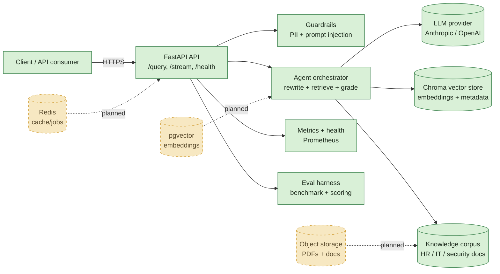

# RAG Agent

[](https://github.com/FarnazNK/rag-agent/actions)
[](https://www.python.org/)
[](#testing)
[](https://www.docker.com/)

A production-style retrieval-augmented generation system for enterprise knowledge search, grounded response generation, and measurable AI quality. This project demonstrates how to design a RAG pipeline that is not only functional, but also deployable, observable, and evaluated under realistic constraints.

I built this as a portfolio project for AI engineering and ML platform roles, with emphasis on the engineering surfaces that matter in production: orchestration, retrieval quality, safety, observability, performance, and evaluation.

> Note: the corpus is synthetic and intended for portfolio/demo use. It is based on HR, IT, and security policies and is not tied to a real organization.

## Why this project matters

Many AI demos stop at “the model answered a question.” This project goes further and addresses the actual production concerns behind a reliable RAG system:

- trustworthy retrieval over a knowledge base
- explicit graph-based orchestration instead of ad hoc prompt loops
- guardrails for prompt injection and PII leakage
- benchmark-driven evaluation across model and retrieval configurations
- async serving patterns for latency and throughput
- deployment readiness with Docker and CI automation

## What is included

- LangGraph-based orchestration with routing, query rewrite, grading, and answer generation
- Hybrid retrieval using dense vector search and BM25 lexical matching
- Reciprocal rank fusion to combine retrieval signals
- FastAPI service with health checks and Prometheus metrics
- SSE streaming endpoint for interactive UIs
- Input and output guardrails for PII and prompt-injection detection
- Synthetic evaluation dataset and benchmark harness for reproducible quality comparisons
- Dockerized runtime and GitHub Actions CI pipeline

## Architecture



### Architecture principles

- Explicit control flow: the agent is designed as a graph rather than a free-form reasoning loop.
- Retrieval quality is treated as a first-class system concern, not a side effect of prompting.
- Guardrails are built into both input and output stages to reduce harmful behavior and leakage.
- Observability is intentional: latency, queue behavior, guardrail decisions, and benchmark results are all measurable.
- Evaluation is repeatable: configuration changes are compared against the same dataset and scoring rules.

## Core capabilities

### 1. Retrieval pipeline

The agent combines semantic retrieval and lexical matching to improve recall on real-world enterprise queries.

Examples of the kinds of questions it handles well:

- acronyms and product names
- paraphrased policy questions
- domain-specific terminology
- grounded answers with source-aware citations

### 2. Guardrails and safety

The system includes pattern-based checks for:

- prompt injection attempts
- PII detection in inputs and outputs
- source verification before final response delivery

This makes the system safer as a production-ready RAG foundation rather than an unguarded chatbot.

### 3. Serving layer

The FastAPI layer exposes:

- POST /query for standard answer generation
- POST /stream for Server-Sent Events streaming
- GET /health for liveness checks
- GET /metrics for Prometheus monitoring

The serving path is built to avoid blocking the event loop and is designed with queueing, batching, and deadline-aware execution in mind.

### 4. Evaluation and benchmarking

This project includes an internal eval framework with:

- YAML-defined test datasets
- multiple scoring strategies
- benchmark comparisons across retrieval configurations
- CI-friendly pass thresholds

This is one of the strongest signals for production readiness in an AI portfolio project.

## Tech stack

- Python 3.11+
- LangGraph
- LangChain
- Chroma
- FastAPI
- Uvicorn
- Prometheus client
- Pydantic
- BM25 / hybrid retrieval
- pytest + Ruff + mypy
- Docker + GitHub Actions

## Repository structure

```text
.
├── src/
│   └── rag_agent/
│       ├── agent.py
│       ├── api/
│       ├── graph/
│       ├── retrieval/
│       ├── guardrails/
│       ├── observability/
│       ├── vectorstore/
│       ├── schemas.py
│       └── cli.py
├── tests/
├── scripts/
├── benchmarks/
├── data/
├── Dockerfile
├── docker-compose.yml
├── pyproject.toml
├── Makefile
├── README.md
├── .github/workflows/
└── .env.example
```

## Quick start

### 1. Install dependencies

```bash
python -m venv .venv
source .venv/bin/activate
pip install -e ".[dev,api,tracing]"
```

### 2. Run the API

```bash
make serve
```

The app will be available at:

- http://localhost:8000/docs
- http://localhost:8000/health
- http://localhost:8000/metrics

### 3. Ask a question

```bash
make ask Q="What does the PTO policy say for new hires?"
```

### 4. Run the evaluation suite

```bash
make eval
```

### 5. Run Docker-based local stack

```bash
docker compose up --build
```

## Example API usage

```bash
curl -X POST http://localhost:8000/query \
  -H "Content-Type: application/json" \
  -d '{"query": "How long is parental leave?"}'
```

Example response structure:

```json
{
  "answer": "Employees receive 12 weeks of paid parental leave...",
  "route": "retrieve",
  "iterations": 1,
  "guardrails": [
    {"name": "pii_detector", "action": "allow"},
    {"name": "prompt_injection_detector", "action": "allow"}
  ]
}
```

## Testing

Run the project test suite:

```bash
make test
```

Current CI status includes 90 passing tests, covering:

- retrieval behavior
- validation and schema checks
- guardrail logic
- scheduler / async execution behavior
- benchmark and serving smoke checks

## CI/CD and deployment

This project is configured for:

- GitHub Actions lint + type checks
- Python test execution
- Docker build validation
- benchmark smoke tests
- container build pipeline

The Docker setup supports quick local validation and production-oriented image builds.

## Project highlights for recruiters

This project demonstrates that I can work across the full AI engineering stack:

- model orchestration and system design
- retrieval and ranking design
- production-safe AI behavior
- API development and operational monitoring
- evaluation frameworks and benchmarking
- deployment automation and containerization

It is designed to show capability in both applied ML and engineering-focused software delivery.

## Roadmap

Potential next steps for production maturity:

- pgvector or enterprise vector database integration
- user-scoped document ownership and authentication
- persistent document ingestion pipelines
- embedding model tuning and evaluation
- observability dashboards and alerting
- multi-tenant deployment and scaling patterns

## License

This project is intended for portfolio and learning use. See the repository license for usage details.

---

Built to showcase end-to-end AI systems engineering: retrieval, orchestration, safety, benchmarking, and deployment readiness.
