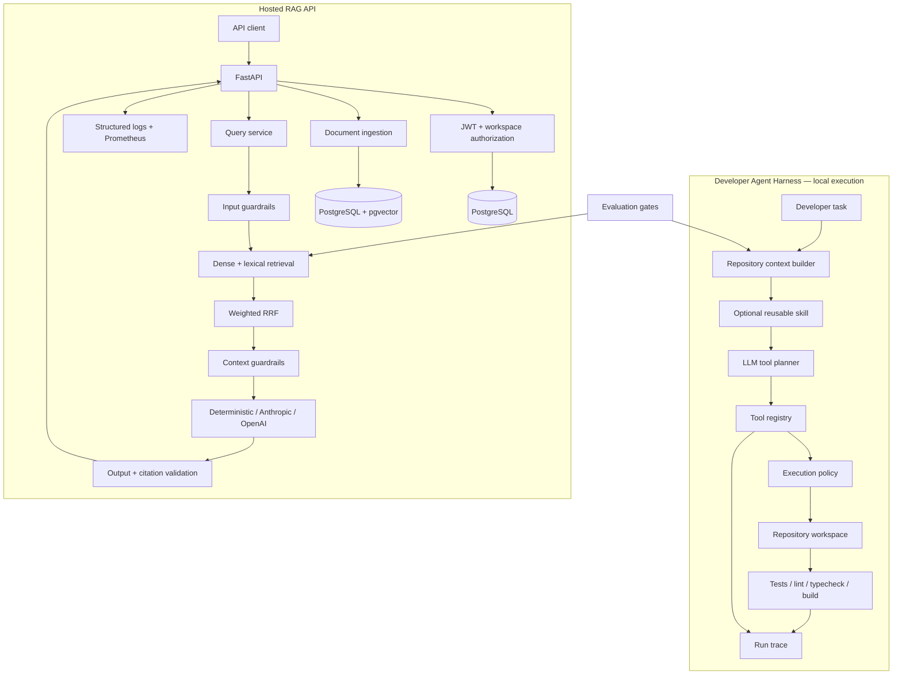

# RAG Agent — Retrieval + Developer Agent Platform

[](https://github.com/FarnazNK/rag-agent/actions/workflows/ci.yml)


**Live RAG API:** [API](https://rag-agent-api-2uau.onrender.com/) · [Docs](https://rag-agent-api-2uau.onrender.com/docs) · [Liveness](https://rag-agent-api-2uau.onrender.com/health/live) · [Readiness](https://rag-agent-api-2uau.onrender.com/health/ready)

RAG Agent is a production-oriented AI systems project with two complementary surfaces:

1. a multi-tenant retrieval-augmented generation API for grounded document answers; and
2. a repository-aware developer-agent harness for context selection, tool use, reusable skills, verification, and traceable software-engineering workflows.

The design focuses on the parts that make AI systems useful beyond a demo: **context quality, explicit tool boundaries, evaluation, guardrails, authorization, observability, reproducible CI, and operational trade-offs**.

> The hosted service exposes the RAG API only. Repository filesystem and command tools are intentionally local-only. Write-capable agents should run inside stronger ephemeral sandbox boundaries before being exposed as a remote service.

## What this project demonstrates

### Developer-agent infrastructure

- Task-aware repository context selection with a bounded context budget
- JSON tool-planning loop for Anthropic or OpenAI models
- Registry-backed tools for file listing, reads, code search, writes, and verification commands
- Explicit write opt-in rather than implicit filesystem mutation
- Repository-root confinement and sensitive-path blocking
- Verification-command allowlisting with shell-free subprocess execution
- Reusable YAML skills for code changes, debugging, and read-only review
- Structured per-step run traces with tool outcomes and changed-file tracking
- Context-selection evaluation dataset and CI quality gate
- Deterministic offline planner for CI and context-only dry runs

### Production RAG

- Authenticated document upload, re-index, deletion, and query APIs
- Organizations, workspaces, membership-based authorization, and tenant isolation
- PostgreSQL persistence with pgvector dense retrieval
- PostgreSQL lexical/full-text retrieval
- Weighted reciprocal-rank fusion for hybrid search
- Bounded overlapping chunking
- Deterministic local embedding and LLM providers for reproducible CI
- Optional Anthropic and OpenAI adapters
- Deterministic regex-based prompt-injection screening on input and retrieved context; useful as a first-pass filter, but intentionally treated as bypassable and not a security boundary
- PII/output guardrails and citation validation
- Retrieval and embedding caches with index-version invalidation
- Structured JSON logging and request correlation IDs
- Prometheus metrics and Grafana dashboard
- Quality, adversarial, latency, security, and Docker gates in CI
- Terraform and AWS Lambda/SAM deployment paths

## Architecture



The two surfaces share the same engineering principles: **retrieve only relevant context, constrain model capabilities outside the model, measure quality independently, and make behavior observable**.

## Developer Agent Harness

A software-engineering agent should not receive an entire large repository or unrestricted machine access. This project separates the problem into four layers.

### 1. Context engineering

`RepositoryContextBuilder` scans supported source/text files, ignores generated and vendor directories, ranks files against the engineering task, applies per-file bounds, and enforces a total context budget.

Context selection is deterministic so it can be evaluated separately from model behavior.

```text
task
  ↓
candidate repository files
  ↓
path + content relevance scoring
  ↓
bounded top-k context
  ↓
planner
```

### 2. Skills

Reusable behavior lives under `agent_skills/`:

- `code-change.yaml` — inspect, make the smallest change, then verify
- `debug.yaml` — reproduce/trace before editing, then rerun the failing check
- `review.yaml` — read-only correctness/security/reliability review

Each skill carries instructions and its own tool allowlist. Adding or changing a workflow does not require changing the harness.

### 3. Tool registry and policy

The model chooses among narrow tools:

| Tool | Purpose |
| --- | --- |
| `list_files` | Inspect repository structure |
| `read_file` | Read a repository file |
| `search_code` | Search matching source lines |
| `write_file` | Replace/create a file when writes are explicitly enabled |
| `run_check` | Run approved test/lint/typecheck/build commands |
| `finish` | Complete the run with a summary |

The runtime validates every request independently of the model. The policy blocks path traversal, credential-like paths, unapproved commands, oversized writes, and writes that were not explicitly enabled.

Commands run without a shell and receive a restricted environment so provider credentials are not automatically inherited by child processes.

### 4. Trace and verification

Every run records:

- selected repository context;
- planner decisions and reasons;
- tool inputs;
- tool success/failure;
- policy blocks;
- changed files; and
- verification output.

This creates an inspectable artifact for debugging agent behavior instead of treating the model as a black box.

See [docs/developer-agent.md](docs/developer-agent.md) and [ADR 0008](docs/adr/0008-developer-agent-harness.md).

## Local developer-agent usage

Install the project:

```bash
python -m venv .venv
source .venv/bin/activate
pip install -e '.[dev]'
```

Deterministic mode performs a context-only dry run and requires no model API key:

```bash
rag-agent dev-agent \
  --repo . \
  --task "Trace how request authentication is enforced"
```

Use a configured remote model for iterative tool use:

```bash
export APP_LLM_PROVIDER=anthropic
export APP_LLM_MODEL=<model-name>

rag-agent dev-agent \
  --repo . \
  --skill review \
  --task "Review the authentication path for reliability and security"
```

File mutation is disabled unless the operator opts in for that specific invocation:

```bash
rag-agent dev-agent \
  --repo . \
  --skill code-change \
  --allow-writes \
  --task "Add validation for the new field and verify the relevant tests"
```

The current policy layer is defense in depth, **not an OS-level sandbox**. A production write-enabled service should add ephemeral containers or VMs, network isolation, resource limits, scoped credentials, and stronger approval/authorization controls.

## Agent evaluation

Repository context quality is gated independently from the model.

```bash
python scripts/run_agent_evals.py \
  --dataset data/agent_evals/context_selection.yaml \
  --threshold 0.75
```

The evaluator checks whether known engineering tasks retrieve expected implementation files in the top-k context. CI publishes the resulting JSON report alongside the RAG evaluation and latency reports.

This separation matters because a coding agent can fail for different reasons:

```text
wrong context
    vs
bad model decision
    vs
tool/policy failure
    vs
verification failure
```

Measuring those stages independently makes regressions easier to diagnose.

## RAG retrieval pipeline

```text
JWT + workspace authorization
        ↓
input guardrails
        ↓
dense retrieval + lexical retrieval
        ↓
weighted reciprocal-rank fusion
        ↓
retrieved-context guardrails
        ↓
LLM generation
        ↓
citation + output validation
        ↓
grounded response
```

Dense retrieval handles semantic similarity while lexical search preserves exact terms, identifiers, acronyms, and policy names.

## RAG API

| Route | Purpose |
| --- | --- |
| `POST /v1/auth/bootstrap` | Bootstrap initial local/admin workspace when enabled |
| `POST /v1/auth/login` | Authenticate and issue an access token |
| `GET /v1/workspaces` | List workspaces available to the current user |
| `POST /v1/documents/upload` | Parse, chunk, embed, and persist a document |
| `GET /v1/documents` | List workspace documents |
| `POST /v1/documents/{id}/reindex` | Rebuild chunks and embeddings |
| `DELETE /v1/documents/{id}` | Delete a document and invalidate retrieval state |
| `POST /v1/query` | Run workspace-scoped hybrid retrieval and generation |
| `GET /health/live` | Liveness check |
| `GET /health/ready` | Readiness check |
| `GET /metrics` | Prometheus metrics |

## CI quality gates

Every pull request runs:

1. Ruff linting
2. Ruff formatting validation
3. mypy type checking
4. database migrations
5. unit tests
6. PostgreSQL/pgvector integration tests
7. RAG quality evaluation
8. adversarial evaluation
9. developer-agent context evaluation
10. latency regression benchmark
11. dependency vulnerability scanning
12. production Docker image build

Evaluation and benchmark reports are uploaded as CI artifacts.

## Observability

The application uses structured JSON logging and request/run correlation context. The hosted RAG API exports Prometheus metrics for request volume, latency, retrieval, model calls, token usage, ingestion outcomes, caching, and groundedness.

Developer-agent runs produce structured events for:

- run start/completion;
- selected context;
- allowed tools;
- planner failures;
- each tool invocation;
- policy blocks;
- write activity; and
- max-step termination.

Optional LangSmith tracing can be enabled for hosted model calls by supplying the corresponding environment key.

## Deployment

The public RAG demo runs on Render with managed Neon PostgreSQL/pgvector and deterministic providers. The repository also contains:

- Docker / Docker Compose
- Terraform environment scaffolding
- AWS Lambda/SAM deployment configuration
- GitHub OIDC deployment workflow
- CloudWatch logging configuration
- Alembic database migrations

The hosted instance is a demo deployment, not a production SLA.

A production deployment would still need organization-specific secret management, backups, rollout/rollback controls, alerts, capacity planning, and model-provider credentials where applicable.

## Technology stack

**AI / retrieval**
- hybrid dense + lexical retrieval
- pgvector
- Anthropic and OpenAI model adapters
- deterministic providers for reproducible CI
- deterministic first-pass prompt/context screening plus output/citation validation
- RAG and developer-agent evaluations

**Backend**
- Python 3.11+
- FastAPI
- Pydantic
- SQLAlchemy
- PostgreSQL 16
- Alembic

**Agent platform**
- repository context selection
- JSON tool planning
- registry-backed tools
- declarative skills
- policy-controlled execution
- structured run traces

**Delivery / operations**
- Docker and Docker Compose
- GitHub Actions
- Terraform
- AWS SAM / Lambda
- Prometheus and Grafana
- structured JSON logging

## Repository map

```text
agent_skills/                 reusable developer-agent skills
data/
  agent_evals/                developer-agent context evaluation cases
  eval_datasets/              RAG quality/adversarial datasets
docs/
  adr/                        architecture decisions
  developer-agent.md          developer-agent design and safety model
infra/                        Terraform and AWS deployment assets
monitoring/                   Prometheus and Grafana configuration
scripts/
  run_agent_evals.py          developer-agent context quality gate
  run_evals.py                RAG evaluation runner
src/rag_agent/
  agent/                      context, planner, tools, policy, skills, harness
  api/                        FastAPI surface and metrics
  evals/                      RAG evaluators/scorers
  guardrails/                 input/context/output controls
  retrieval.py                hybrid retrieval
  service.py                  RAG orchestration
tests/                        unit and integration coverage
```

## Design principles

- **Context is a system component.** Measure what the model sees instead of treating prompt assembly as incidental.
- **Models propose; policy decides.** Tool access is enforced outside the LLM.
- **Guardrails are layered, not magical.** Regex-based prompt-injection checks are deterministic and testable, but bypassable; authorization, tool policy, sandboxing, and output validation carry the real security boundary.
- **Verification is part of the workflow.** A code change is not complete merely because text was generated.
- **AI quality needs evals.** Deterministic gates catch regressions before deployment.
- **Observability applies to agent behavior too.** Decisions, tools, failures, and outcomes should be inspectable.
- **Claims should match deployed reality.** Hosted, local, implemented, and planned components are described separately.
